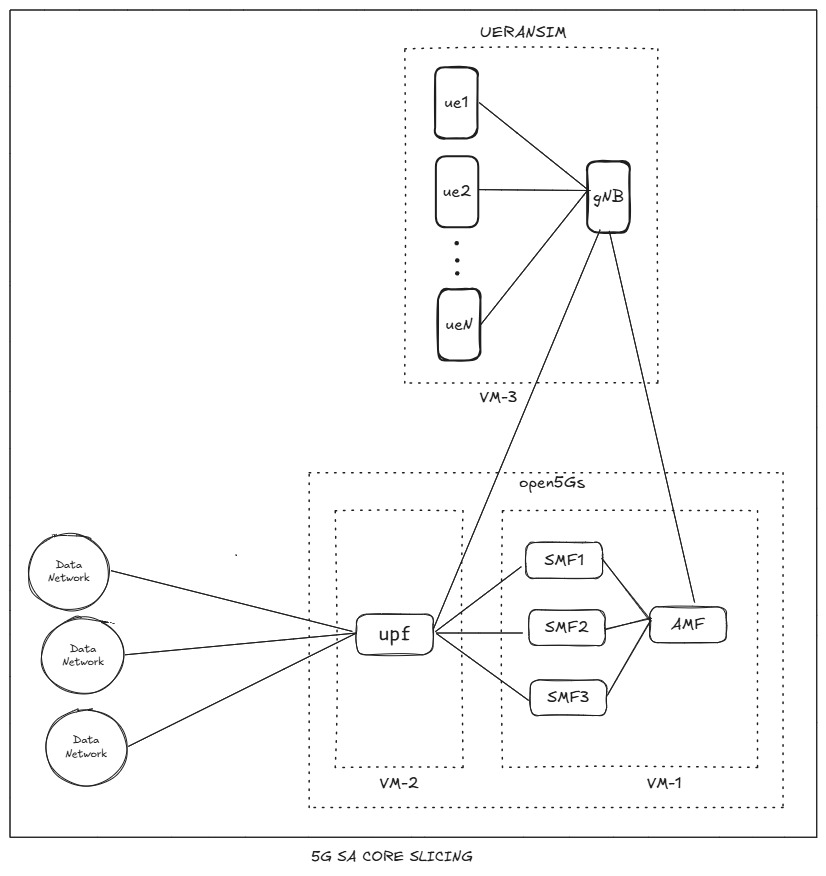
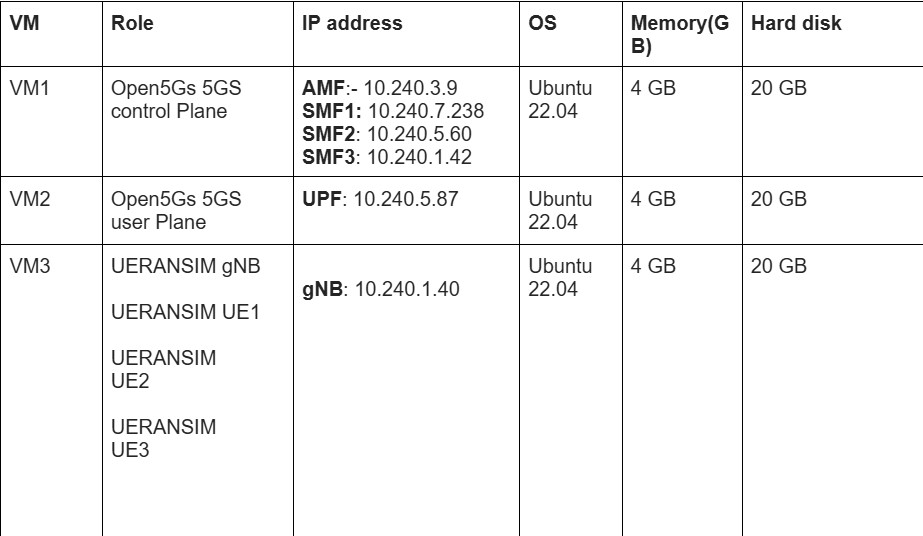
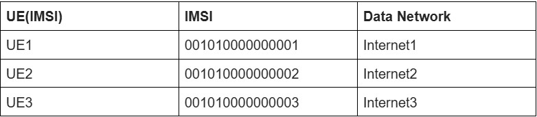
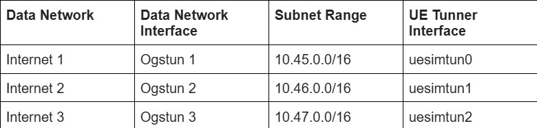

# 5G Standalone Core Network Slicing

## Installation

### 1. Open5GS 5G Core Installation

#### I) Getting MongoDB

1. Import the public key used by the package management system:

   ```bash
   sudo apt update
   sudo apt install gnupg
   curl -fsSL https://pgp.mongodb.com/server-6.0.asc | sudo gpg -o /usr/share/keyrings/mongodb-server-6.0.gpg --dearmor
   ```

2. Add the MongoDB repository:

   ```bash
   echo "deb [ arch=amd64,arm64 signed-by=/usr/share/keyrings/mongodb-server-6.0.gpg] https://repo.mongodb.org/apt/ubuntu jammy/mongodb-org/6.0 multiverse" | sudo tee /etc/apt/sources.list.d/mongodb-org-6.0.list
   sudo apt update
   ```

3. Install MongoDB:

   ```bash
   sudo apt install -y mongodb-org
   ```

4. Start MongoDB (if `/usr/bin/mongod` is not running):

   ```bash
   sudo systemctl start mongod
   ```

5. Ensure MongoDB starts automatically on system boot:

   ```bash
   sudo systemctl enable mongod
   ```

#### II) Install Open5GS

1. Add the Open5GS repository:

   ```bash
   sudo add-apt-repository ppa:open5gs/latest
   sudo apt update
   ```

2. Install Open5GS:

   ```bash
   sudo apt install open5gs
   ```

#### III) Install the WebUI of Open5GS

1. Download and import the NodeSource GPG key:

   ```bash
   sudo apt update
   sudo apt install -y ca-certificates curl gnupg
   sudo mkdir -p /etc/apt/keyrings
   curl -fsSL https://deb.nodesource.com/gpgkey/nodesource-repo.gpg.key | sudo gpg --dearmor -o /etc/apt/keyrings/nodesource.gpg
   ```

2. Create the Node.js repository:

   ```bash
   export NODE_MAJOR=20
   echo "deb [signed-by=/etc/apt/keyrings/nodesource.gpg] https://deb.nodesource.com/node_$NODE_MAJOR.x nodistro main" | sudo tee /etc/apt/sources.list.d/nodesource.list
   ```

3. Update and install Node.js:

   ```bash
   sudo apt update
   sudo apt install nodejs -y
   ```

4. Install the Open5GS WebUI:

   ```bash
   curl -fsSL https://open5gs.org/open5gs/assets/webui/install | sudo -E bash -
   ```

---

### 2. UERANSIM Installation

1. Update the system:

   ```bash
   sudo apt update
   sudo apt upgrade
   ```

2. Install dependencies:

   ```bash
   sudo apt install make g++ libsctp-dev lksctp-tools
   sudo snap install cmake --classic
   ```

3. Clone the UERANSIM repository and build it:

   ```bash
   git clone https://github.com/aligungr/UERANSIM
   cd UERANSIM
   make
   ```
## 5G Core Network Slicing Simulation Setup




Each VMs are as follows.



Subscriber Information (other information is default) is as follows.



Each DNs are as follows.




Please refer to the following for Configuration of control plane,user plane, gNB and UE.

https://github.com/s5uishida/open5gs_5gc_ueransim_nearby_upf_sample_config

https://github.com/s5uishida/open5gs_5gc_ueransim_sample_config

https://nickvsnetworking.com/my-first-5g-core-open5gs-and-ueransim/

### contributors :
Chirag Modi.
Alay Patel.
Aman Gupta.


